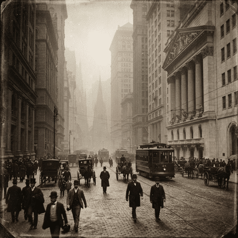
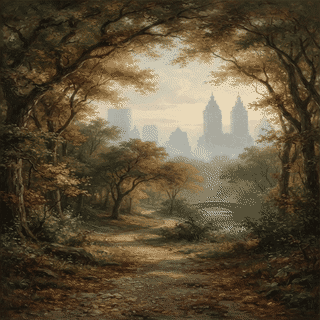
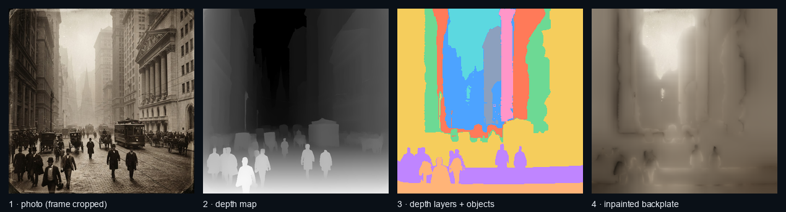
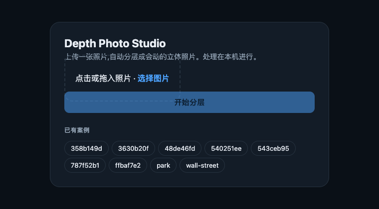
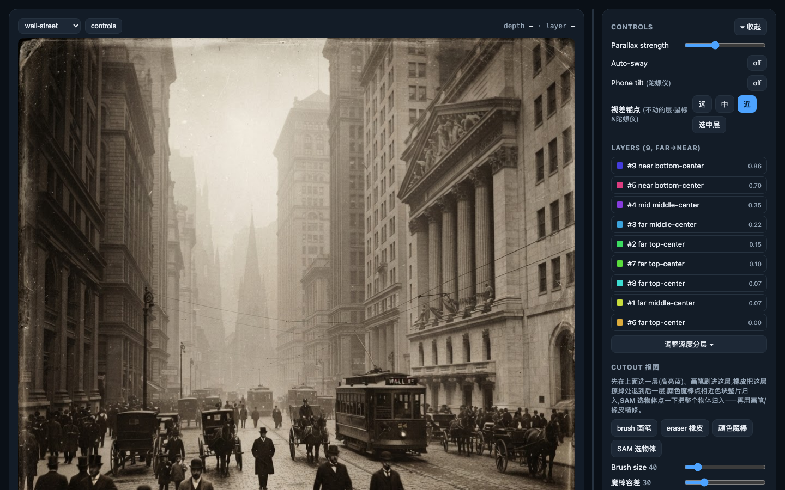
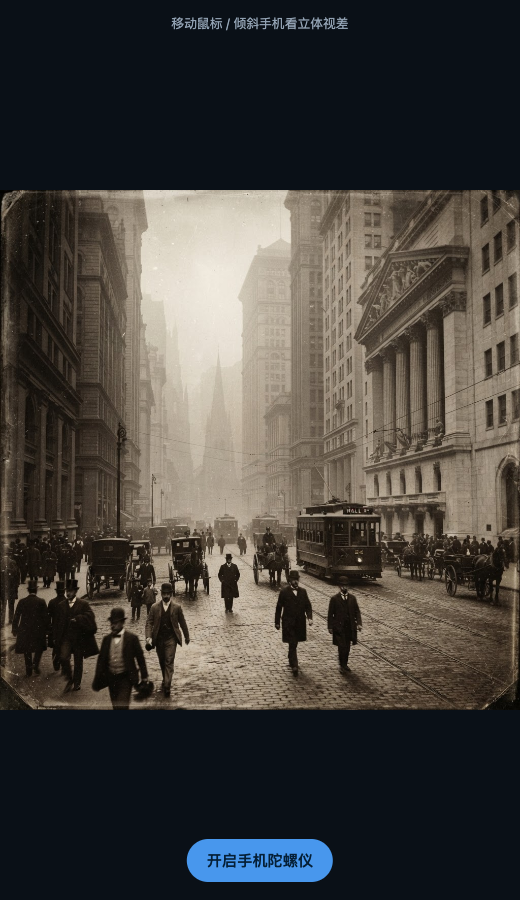

# photo-with-depth

Turn a flat photo into a **layered 3D photo (LDI)** that moves with your mouse or your phone's gyroscope.

The pipeline estimates depth, slices the scene into layers, cuts each layer out as its own sprite, inpaints what was hidden behind it, and hands the stack to a WebGL viewer that slides the layers at different speeds. Everything runs locally.

<p align="center">
  
  
</p>

<sub>Left: a photograph. Right: an oil painting — the same pipeline works on both. These GIFs are rendered from the exact sprite stack the browser viewer uses.</sub>

## How it works



1. **Crop the frame** — local-variance scan finds the real content edge and drops picture frames / white borders.
2. **Estimate depth** — [Depth Anything V2](https://huggingface.co/depth-anything/Depth-Anything-V2-Small-hf) (small) → a 0–1 depth map.
3. **Slice into layers** — a *valley* split: peaks in the depth histogram become layer centres, valleys become boundaries. [SAM 2](https://huggingface.co/facebook/sam2.1-hiera-tiny) object masks are then snapped onto whichever layer covers ≥90% of them, so a person never gets sawn in half by a depth boundary.
4. **Inpaint the backplate** — each layer is lifted out and the hole behind it is filled, so nearer layers can slide without smearing a ghost.
5. **Bake sprites** — one RGBA cutout per layer (`sprite_00` = farthest), composited far→near in the viewer with a per-layer offset.

## Quick start

```bash
python -m venv .venv && source .venv/bin/activate
pip install -r requirements.txt
python app.py                     # opens http://localhost:8000
```

Drop in a photo and wait — the first run downloads the depth and SAM 2 weights (~1 GB). Processing is CPU/MPS-friendly; a 1024px image takes roughly a minute.

<p align="center"></p>

## The editor

Once a photo is processed you land in the editor, where the layering is yours to fix — automatic depth slicing is a starting point, not a verdict.



- **Motion** — mouse, auto-sway, or phone gyroscope (needs HTTPS on a real device). Pick the *parallax anchor*: which depth stays pinned while everything else moves around it.
- **Layer list** — select a layer to highlight it, nudge it forward/back in depth, freeze it, or hide it.
- **Cutout tools** — brush, eraser, colour wand, and *SAM object pick* (one click assigns a whole detected object to the current layer). Re-bake to regenerate the backplate and sprites from your edits.
- **Depth curve** — drag the boundaries between layers directly on the depth histogram.
- **Particles** — stars, dust, bokeh, snow, or leaves, bound per-layer so they get occluded by anything nearer. Direction, spread, count, speed, and front↔back brightness are all adjustable.
- **Export** — bundles the scene into a single self-contained HTML file (sprites inlined as base64) you can send to someone. No server, no dependencies; it just works when opened.

<p align="center"></p>

## Command line

The web app is a wrapper around scripts that are all runnable on their own:

```bash
# Light: crop + depth + valley layering (skips SAM, fast)
python generate_depth_photo.py --input examples/wall-street.png

# Full: SAM + valley + object snapping + backplate + LDI sprites
python build_objects.py                 # merge objects into shared layers (default)
python build_objects.py --per-object    # every object gets its own layer
python build_objects.py --layer-groups  # older depth-band-only mode

# Re-run a single stage against existing outputs
python build_scene.py                       # re-slice using the cached depth map
python build_background.py --method harmonic
python build_sprites.py

# Render a parallax preview GIF
python build_preview.py --layered
```

### Inpainting methods

`build_background.py --method` decides how the hole behind a lifted layer gets filled:

| Method | Behaviour |
|---|---|
| **harmonic** | Laplace membrane — smooth, seamless, follows neighbouring brightness. Default. |
| **pushpull** | Image-pyramid fill. Fast, but flattens toward the average in deep holes. |
| bleed / mode | Nearest-neighbour / modal colour. Cheap; streaks or patches. |
| lama | LaMa neural inpainting (needs `simple-lama-inpainting`). |
| telea | Classic OpenCV fast marching. Blurry. |

## Tuning notebook

`notebooks/depth_classifier_lab.ipynb` is an interactive bench for the layering parameters — valley sensitivity, the SAM coverage threshold, the flat-object cutout threshold. Publish to `outputs/` once a setting looks right.

## Layout

```
step_1_crop_frame.py       crop picture frames / borders
step_2_build_depth_map.py  Depth Anything V2 → depth map
step_3_build_regions.py    prepare_depth → choose_levels → assign → split → describe
objects.py                 SAM 2 masks, object→layer snapping, flat-object cutouts
regions.py                 1-D k-means, elbow selection, naming, save_scene
build_*.py                 CLI entry points (scene / background / sprites / preview / objects)
pipeline.py                the whole chain as one function, used by the app
app.py                     FastAPI backend — upload, progress, re-bake, export
web/app.html               upload screen
index.html                 WebGL layered editor
viewer_template.html       template for the self-contained exported viewer
outputs/cases/<name>/      per-photo artifacts (gitignored)
```

A case folder holds `cropped_input.png`, `depth_map.png`, `region_labels.png`, `segments.png`, `background.png`, `scene.json`, and `sprites/sprite_NN.png`. The editor reads nothing else, so a case is portable — copy the folder and it loads.

## Requirements

Python 3.10+, plus `torch`, `transformers`, `opencv-python`, `numpy`, `Pillow`, `fastapi`, `uvicorn`. Optional: `simple-lama-inpainting` for the `lama` backfill. A GPU (CUDA or Apple MPS) is used automatically when present but is not required.

> Note: the editor and upload UI are currently labelled in Chinese.
